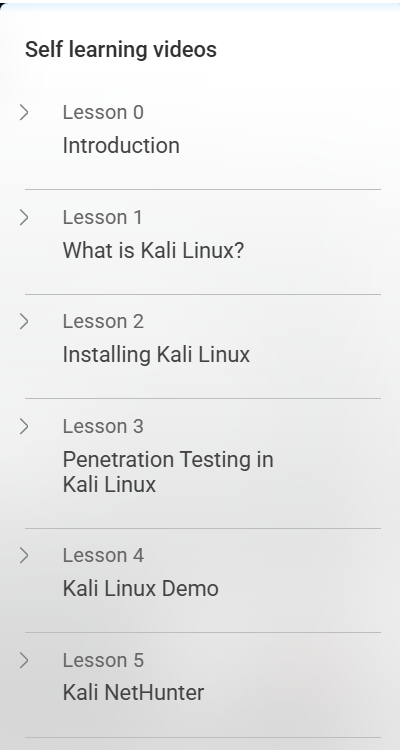
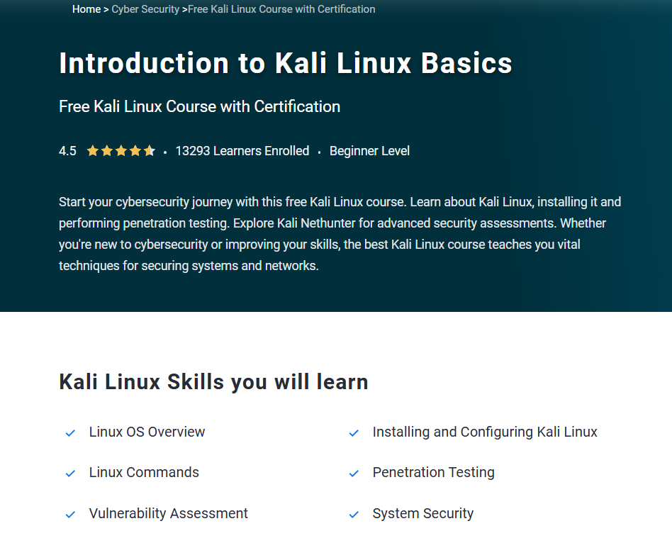

# 🖥 Introduction to Kali Linux Basics – Simplilearn

This repository documents my learning and practice from the **"Introduction to Kali Linux Basics"** course by [Simplilearn](https://www.simplilearn.com/).  
It includes course notes, basic penetration testing demos, advanced analysis, screenshots, and the completion certificate.

---

## 📜 Certificate

- 🧠 [Kali Linux Basics Certificate](./cert/8779947_91613071755093241305.pdf)

---

## 📒 Topics Covered

- 🖥 Overview of Kali Linux environment  
- 🛠 Basic command-line navigation  
- 🔍 Information gathering & reconnaissance  
- 🐚 Using built-in tools (Nmap, Nikto, Dirb)  
- 🧑‍💻 File and process management in Linux  
- 🛡 Introduction to penetration testing methodology  

---

## 📂 Structure

| Folder        | Description |
|---------------|-------------|
| `notes/`      | Course notes by topic |
| `demo/`       | Tool usage examples and lab demonstrations |
| `analysis/`   | Case studies, methodologies, and tool comparisons |
| `screenshots/`| Lab screenshots and course captures |
| `cert/`       | Certificate of course completion |
| `LICENSE`     | AGPLv3 license details |

---

## 📘 Notes

- [`kali-intro.md`](./notes/kali-intro.md)  
- [`linux-commands.md`](./notes/linux-commands.md)  
- [`information-gathering.md`](./notes/information-gathering.md)  
- [`basic-tools.md`](./notes/basic-tools.md)  

---

## 💻 Demo

- [`nmap-basic-scan.md`](./demo/nmap-basic-scan.md)  
- [`nikto-web-scan.md`](./demo/nikto-web-scan.md)  
- [`dirb-directory-enum.md`](./demo/dirb-directory-enum.md)  

---

## 🔎 Advanced Analysis

- [`pt-methodology.md`](./analysis/pt-methodology.md) – Steps of penetration testing using Kali  
- [`tool-comparison.md`](./analysis/tool-comparison.md) – Comparing reconnaissance and scanning tools  
- [`case-study.md`](./analysis/case-study.md) – Applying Kali tools in a simulated engagement  

---

## 📸 Screenshots

| Description               | Screenshot |
|---------------------------|------------|
| 📜 Course Overview        |  |
| 🖥 Module Introduction    |  |
| 📝 Course Review Summary  |  |

---

## 📝 Course Review

This course provides a beginner-friendly introduction to **Kali Linux** and basic penetration testing workflows.  
It focuses on essential tools, command-line skills, and initial reconnaissance techniques.

✅ **What I liked**:  
- Clear explanation of common penetration testing tools  
- Beginner-friendly navigation and command-line practice  
- Practical tool demonstrations  

📌 **To Improve**:  
- Could add more real-world lab challenges  
- More coverage of post-exploitation basics  

---

## ✍️ Author

**Thành Danh** – Pentester & Cybersecurity Research  

GitHub: [@ngvtdanhh](https://github.com/ngvtdanhh)  

Email: ngvu.thdanh@gmail.com

---

## 📄 License

This project is licensed under the terms of the **GNU AGPL v3.0**.  
See [`LICENSE`](./LICENSE) for full details.

© 2025 ngvtdanhh. All rights reserved.
